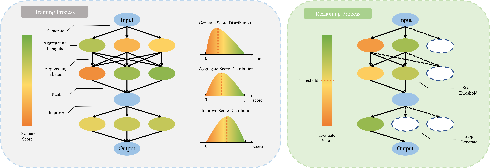

# DGoT: Dynamic Graph of Thoughts for Scientific Abstract Generation



This is the implementation of our LREC-COLING 2024 paper DGoT: Dynamic Graph of Thoughts for Scientific Abstract Generation.

## Acknowledgement

This work is based on the following prompt framework, large language model, and model deployment toolkit. Thanks for the open source contribution!

* [Graph of Thoughts (GoT)](https://github.com/spcl/graph-of-thoughts)
* [ChatGLM2-6B](https://github.com/THUDM/ChatGLM2-6B)
* [InternLM](https://github.com/InternLM/InternLM)
* [LMDeploy](https://github.com/InternLM/lmdeploy)

This paper's computational resources are supported by the High-performance Computing Platform of BUPT.

## Citations

If you find this repository valuable, please give it a star!

Using this in your work? Please reference us using the provided citation:


```
@misc{jaycening2024dgot,
  title = {{DGoT: Dynamic Graph of Thoughts for Scientific Abstract Generation}},
  author = {Xinyu Ning, Yutong Zhao, Yitong Liu, Hongwen Yang},
  year = {2024},
}
```

## Contributor

<a href="https://github.com/JayceNing/ChatBrain/graphs/contributors">
  
</a>

Jayce Ning

Home Page：https://jaycening.github.io/zh-cn/

Github：https://github.com/JayceNing

ZhiHu：https://www.zhihu.com/people/XinyuNing

