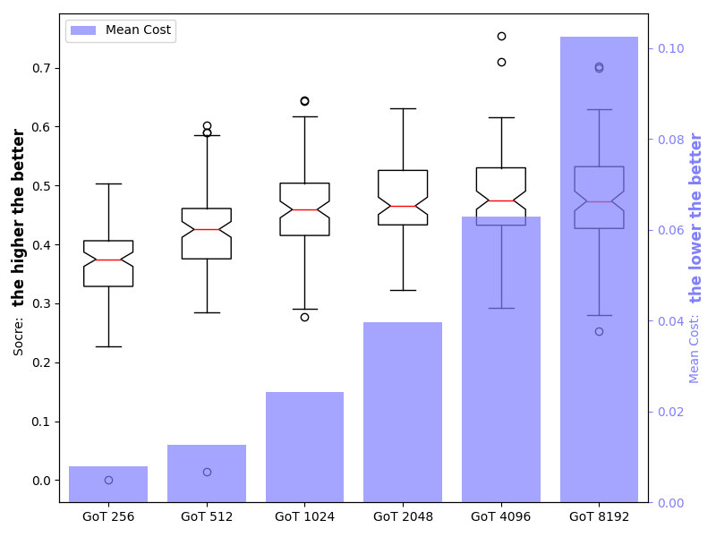
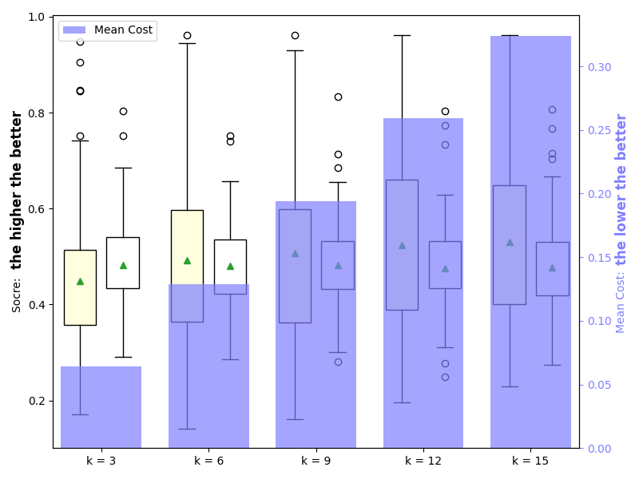
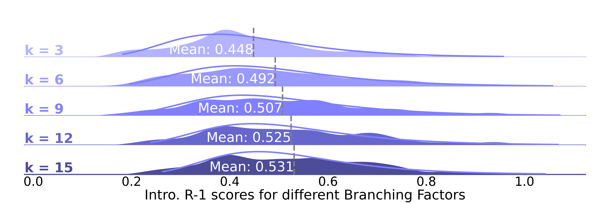
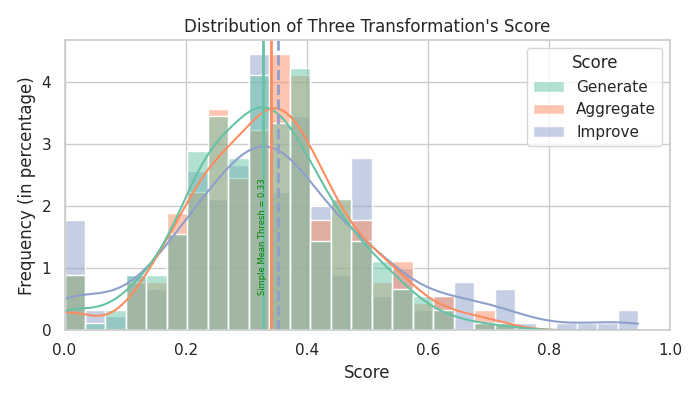
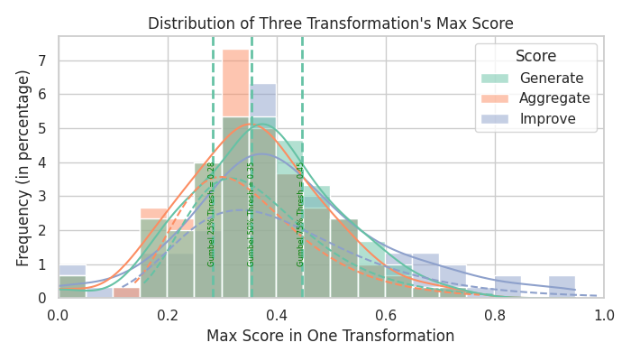
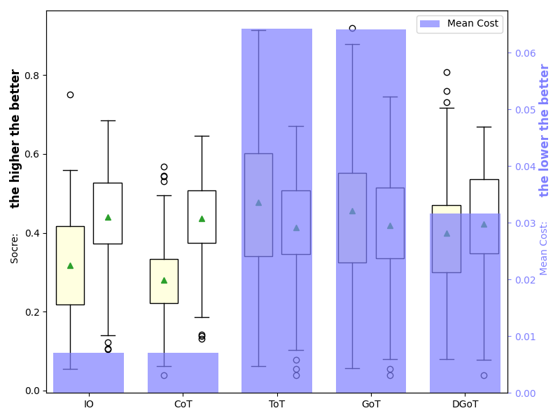

# Appendix Experiment Procedure

This tutorial will provide the experimental steps for the appendix of [DGoT](https://arxiv.org/pdf/2403.17491.pdf).

The experimental categories provided in the appendix procedure include: 
* Prompt Length Testing
* Branching Factor Testing
* Training and Reasoning Process Testing

After each section, the visualization method for the experiment will be provided.

Here, we takes the example of using InternLM2 for inference in a Docker environment.

```bash
# pull docker image
docker pull jaycening/dgot_demo:v1.0.0

# clone this repository
git clone https://github.com/JayceNing/DGoT.git

# Start the container.
docker run --gpus all -it -d --privileged=true -v ./DGoT:/home/nxy/LLM/DGoT --name dgot jaycening/dgot_demo:v1.0.0

docker exec -it dgot /bin/bash

cd /home/nxy/LLM/DGoT
```

## Download the Dataset

```bash
python get_data.py --required_num 100
```
* `required_num` is the number of data entries required for the training and testing datasets to be downloaded.

## Prompt Length Testing
First, use LMDeploy to start the API service for InternLM, then begin inferring on the first 100 samples of the training data based on GoT.

```bash
cd /home/nxy/internlm2_chat_deploy;
nohup lmdeploy serve api_server ./workspace --cache-max-entry-count 0.2 & (sleep 60; cd /home/nxy/LLM/DGoT; python generate_abstract_test_prompt_length.py --begin 0 --end 100 --mode "train" --model "internlm2" --task "test_prompt_length");
```

* `begin` and `end` indicate the starting and ending indices of the dataset being used.
* `mode` indicates whether the dataset being used is train dataset or test dataset.
* `model` represents the LLM used for inference.
* `task` represents the type of task being performed.

The results will be presented in the folder named `./results/internlm2_got_test_prompt_length_{date}`.

### Visualization

**Box plot of the distribution of Abst. R-1 scores together with the bar chart of the costs.**

```bash
python results_processing.py --result_folder_path "./results/internlm2_got_test_prompt_length_{date}" --task "test_prompt_length"
```

* `result_folder_path` is the path to the experimental results. Be sure to replace it with the result path obtained in the previous step.

The following result figure will be obtained at the path mentioned above.



## Branching Factor Testing

If the model API service is not yet started, use the following command:

```bash
cd /home/nxy/internlm2_chat_deploy;
nohup lmdeploy serve api_server ./workspace --cache-max-entry-count 0.2 & (sleep 60; cd /home/nxy/LLM/DGoT; python generate_abstract_test_prompt_length.py --begin 0 --end 100 --mode "train" --model "internlm2" --task "test_nodes_num");
```

Otherwise, directly run the Python code.
```bash
cd /home/nxy/LLM/DGoT; 
python generate_abstract_test_prompt_length.py --begin 0 --end 100 --mode "train" --model "internlm2" --task "test_nodes_num"
```

The results will be presented in the folder named `./results/internlm2_got_test_nodes_num_{date}`.

### Visualization

**Box plot of the distribution of Intro. R-1 / Abst. R-1 scores together with the bar chart of the costs.**

```bash
python results_processing.py --result_folder_path "./results/internlm2_got_test_nodes_num_{date}" --task "draw_intro_abstract_line_box"
```

The following result figure will be obtained at the path mentioned above.



**Overlapping densities plot**

```bash
python results_processing.py --result_folder_path "./results/internlm2_got_test_nodes_num_{date}" --task "draw_node_num_r_i_figure"
```

The results are as follows.



**Transformation Score Distribution Plot**

```bash
python results_processing.py --result_folder_path "./results/internlm2_got_test_nodes_num_{date}/got_4096_3/" --task "cal_and_draw_transformation_score"
```
**Note:** The path here should specify a subfolder related to the branching factor.

The results are as follows.

Transformation Score Distribution


Max transformation Score Distribution


## Training and Reasoning Process Testing
### Training Process
The training process directly utilizes the result distribution obtained from the branching factor test.

After executing the **Transformation Score Distribution Plot** visualization, you will obtain a file containing parameters related to the distribution at e.g. `./results/internlm2_got_test_nodes_num_{date}/got_4096_3_transformation_score_overview.txt`.

### Reasoning Process
Inferencing will be conducted using the thresholds obtained from the aforementioned result file.

```bash
cd /home/nxy/LLM/DGoT; 
python generate_abstract.py --begin 0 --end 100 --mode "test" --model "internlm2" --task "default" --thresh_g 0.34 --thresh_a 0.35 --thresh_i 0.34
```

* `thresh_g`, `thresh_a` and `thresh_i` respectively represent the thresholds used for generating transformation, aggregating transformation, and boosting transformation in DGoT.

The results will be presented in the folder named `./results/internlm2_io-cot-tot-got-dgot_default_{date}`.

### Visualization
```bash
python results_processing.py --result_folder_path "./results/chatglm_io-cot-tot-got-dgot_default_{date}" --task "main_result"
```

